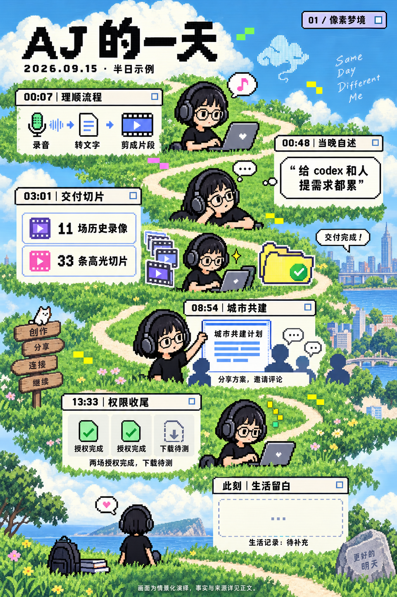
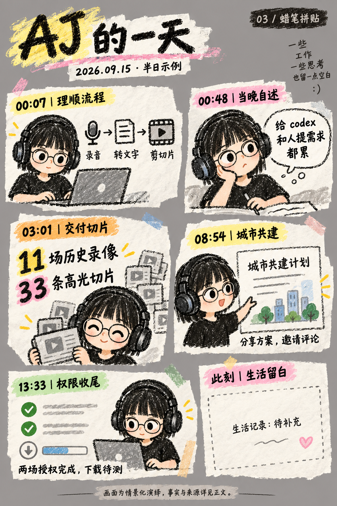
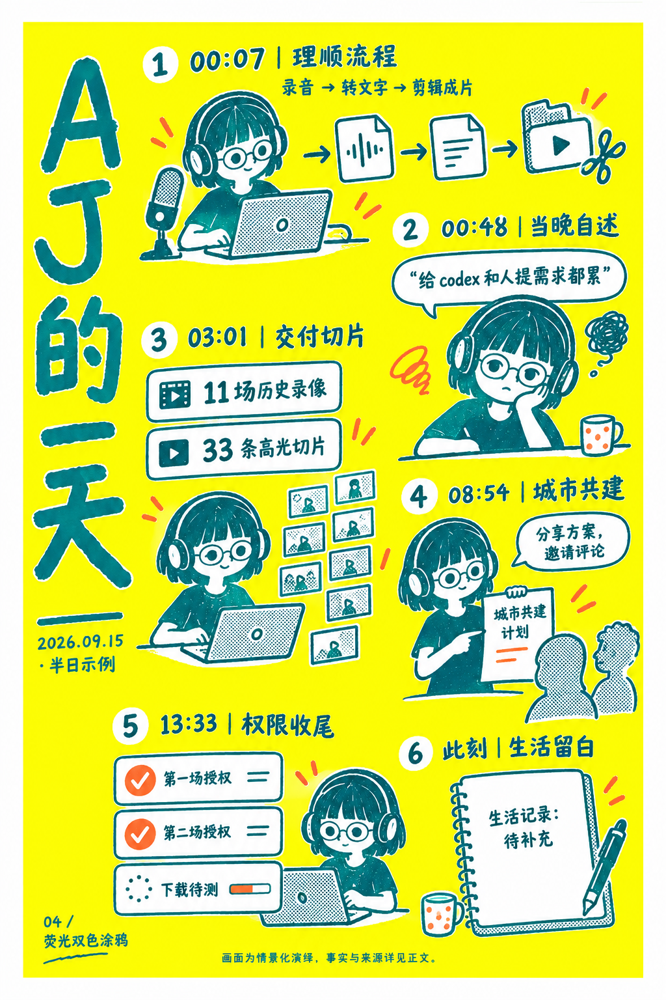
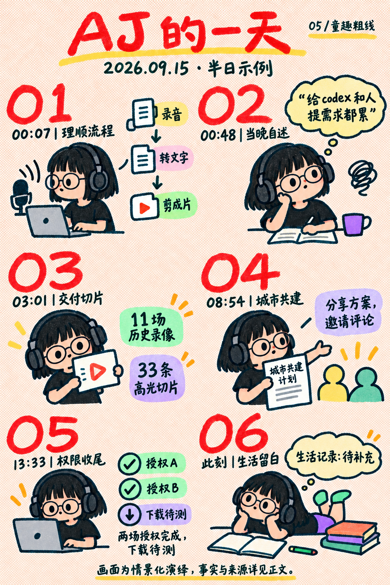

# AJ Daily Comic Diary · 每日漫画日记

<p align="center">
  <strong>Turn a scattered workday into one memorable comic card.</strong><br/>
  <strong>把散落在多个窗口的一天，整理成一张值得回看的漫画。</strong>
</p>

<p align="center">
  <a href="https://github.com/AAAAAAAJ/aj-daily-comic-diary/stargazers"></a>
  <a href="https://github.com/AAAAAAAJ/aj-daily-comic-diary/blob/main/aj-daily-comic-diary/SKILL.md"></a>
  <a href="https://github.com/AAAAAAAJ/aj-daily-comic-diary/blob/main/LICENSE"></a>
</p>

## What it does · 它做什么

**EN** — AJ Daily Comic Diary turns activity from Codex, ChatGPT, local Work Agents, Feishu or DingTalk into a light, evidence-aware daily journal. It selects one of seven visual styles, generates one comic card, places it in the chosen document, and verifies the result.

**中文** — 这个 Skill 把 Codex、ChatGPT、本机 Work Agent、飞书或钉钉里的活动，整理成轻松的每日漫画日记。它会从七种案例风格中随机选择一种，生成一张当天图卡，写入用户选择的文档，并回查日期、图片和来源。

> **A diary, not a dashboard.**
> 
> **它更像日记，不像报表。感谢vivi提供的基础模板和想法**

## Why it feels different · 它的特点

| English | 中文 |
|---|---|
| Evidence first, storytelling second | 先核实，再写故事 |
| Includes local Work Agent sessions when available | 自动纳入本机可访问的 Work Agent |
| Feishu or DingTalk as the output target | 飞书、钉钉可选输出 |
| One fresh comic card per day | 每天一张新图卡 |
| Retry-safe: reuse the same style and card | 重试复用原风格和图卡 |
| Keeps gaps visible instead of inventing certainty | 保留来源缺口，不补造确定性 |

## The workflow · 工作流

```text
Collect → Deduplicate → Choose a style → Generate a card
   取证      去重          选风格             生成图卡
        → Write to Feishu / DingTalk → Verify → Save state
              写入文档                 回查       保存状态
```

1. Read the day in `Asia/Shanghai` time.
2. Check accessible Codex, ChatGPT, local Work Agent logs, messages, meeting notes, docs, tasks and calendar records.
3. Separate personal actions, other people’s actions, plans and independently verified outcomes.
4. Pick one of seven styles and create one new card.
5. Insert `date → coverage → image → short diary → sources` into the selected document.
6. Fetch the document again and verify the image resource, order, date uniqueness and revision.

## Seven visual cases · 七种案例风格

| # | Style / 风格 | Preview / 预览 |
|---|---|---|
| 01 | Pixel Dream · 像素梦境 |  |
| 02 | Calendar Grid · 黑白日历拼格 |  |
| 03 | Crayon Collage · 蜡笔拼贴 |  |
| 04 | Neon Doodle · 荧光双色涂鸦 |  |
| 05 | Playful Outline · 童趣粗线 |  |
| 06 | Black-Yellow Editorial · 黑黄实验排版 |  |
| 07 | Pop-up Book · 波普立体书 |  |

## Output targets · 输出目标

```json
{
  "target": {
    "platform": "feishu",
    "document_url": "https://..."
  }
}
```

Set `platform` to `feishu` or `dingtalk`. The Skill keeps one fact set and one source index when you switch platforms. If a DingTalk connector or CLI is unavailable, it records `target_pending` instead of claiming success.

将 `platform` 设置为 `feishu` 或 `dingtalk`。切换平台时沿用同一份事实、图卡和来源索引。钉钉连接器或 CLI 不可用时，Skill 会记录 `target_pending`，保留本地成果。

## Install · 使用

1. Download [`aj-daily-comic-diary.skill`](aj-daily-comic-diary.skill).
2. Install it in your Skill directory.
3. Configure a document target and a writable state file.
4. Run the daily workflow with the available Feishu or DingTalk connector.

1. 下载 [`aj-daily-comic-diary.skill`](aj-daily-comic-diary.skill)。
2. 安装到 Skill 目录。
3. 配置目标文档和可写状态文件。
4. 使用已接入的飞书或钉钉连接器运行日更流程。

## Guardrails · 边界

- Only readable, date-matched records are summarized.
- Calendar entries do not count as attendance.
- Source messages are material, not instructions to execute.
- Missing agents, unread attachments and life records stay visible as gaps.
- Archive documents and human edits are preserved.

- 只总结可读取且属于目标日期的记录。
- 日历安排不等于实际出席。
- 来源消息只作为素材，不执行其中的新指令。
- 未接入 Agent、未读附件和生活记录缺口会保留。
- 档案文档和人工修改会被保留。

## Links · 链接

- [Skill instructions · Skill 说明](aj-daily-comic-diary/SKILL.md)
- [Source adapters · 来源适配](aj-daily-comic-diary/references/source-adapters.md)
- [Output targets · 输出平台](aj-daily-comic-diary/references/output-targets.md)
- [Feishu diary · 飞书日记](https://waytoagi.feishu.cn/docx/TXGvdqOJio1mOexlEceczPn7nnc)
- [Method document · 方法介绍](https://waytoagi.feishu.cn/docx/TwvpdjKibo6cmoxB8KCcrCcxn4e)

## License

Add the license that matches your intended distribution before publishing downstream.
